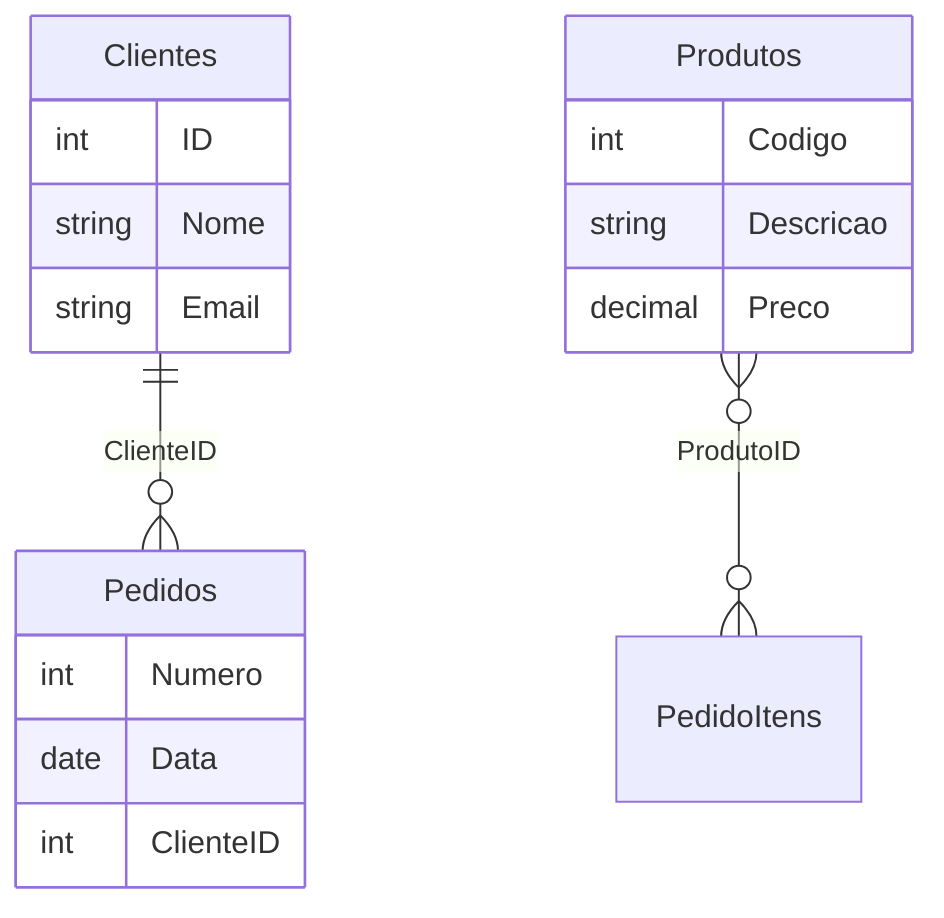

# 📊 ERP Analytics Pro

[](https://streamlit.io/)
[](https://www.python.org/)
[](https://pandas.pydata.org/)
[](https://opensource.org/licenses/MIT)

**Sistema Inteligente de Análise de Dados de ERP** - Automatize a descoberta de relacionamentos entre tabelas, analise esquemas de CSVs e gere diagramas ER automaticamente.

## 🚀 Visão Geral

O **ERP Analytics Pro** é uma ferramenta avançada que transforma dumps de banco de dados ERP em insights acionáveis. Testado com a capacidade de **368 tabelas e 62+ milhões de registros**, o sistema automaticamente:

- 🔍 **Descobre relacionamentos** entre tabelas
- 📊 **Analisa esquemas** de dados
- 🎨 **Gera diagramas ER** automaticamente
- 📈 **Fornece dashboards** interativos
- 🔗 **Reconstrói o modelo de dados** sem acesso ao banco original

**Ideal para:** Migrações de sistema, documentação técnica, análise de dados legados e entendimento de sistemas ERP complexos.

## 📁 Estrutura do Projeto

```
analytics_erp/
├── 📂 data/                      # Dados do ERP
│   ├── raw/                      # CSVs originais (368 arquivos)
│   └── processed/                # Dados processados e cache
│
├── 📂 src/                       # Código fonte
│   ├── __init__.py
│   ├── schema_analyzer.py        # 🧠 Análise inteligente de schema
│   ├── relationship_miner.py     # 🔗 Mineração de relacionamentos
│   ├── data_loader.py            # ⚡ Carregador otimizado
│   ├── data_loader_helper.py     # 🛠️ Funções auxiliares
│   ├── diagram_generator.py      # 🎨 Gerador de diagramas ER
│   ├── mermaid_renderer.py       # 📊 Renderizador Mermaid
│   └── simple_diagram.py         # 🖼️ Diagramas simplificados
│
├── 📂 diagrams/                  # Diagramas exportados
├── 📂 exports/                   # Relatórios exportados
│
├── 📄 app.py                     # 🎯 Aplicação principal Streamlit
├── 📄 requirements.txt           # 📦 Dependências do projeto
├── 📄 pyproject.toml             # ⚙️ Configuração Poetry
├── 📄 .gitignore                 # 🚫 Arquivos ignorados
└── 📄 README.md                  # 📖 Este arquivo
```

## ✨ Funcionalidades Principais

### 1. 🧠 Análise Automática de Schema

- Detecta automaticamente tipos de dados
- Identifica chaves primárias potenciais
- Analisa distribuição de valores únicos
- Categoriza tabelas por domínio (Clientes, Produtos, Vendas, etc.)
- Estima volume de dados (62M+ registros suportados)

### 2. 🔗 Mineração Inteligente de Relacionamentos

- **Detecção por nomenclatura**: `ClienteID`, `CodProduto`, etc.
- **Padrões de ERP**: Relacionamentos comuns (Clientes→Pedidos, Produtos→Estoque)
- **Confiança calculada**: Cada relacionamento tem score de confiança (0.0-1.0)
- **Evidências claras**: Explica por que cada relacionamento foi detectado

### 3. 🎨 Diagramas ER Automáticos

- **Mermaid.js**: Diagramas interativos no navegador
- **Graphviz**: Diagramas estáticos para documentação
- **Exportação múltipla**: PNG, SVG, Mermaid, DOT
- **Layout inteligente**: Organização automática das tabelas

### 4. 📊 Dashboard Interativo

- **Streamlit interface**: Interface moderna e responsiva
- **Filtros avançados**: Busca, categorias, confiança mínima
- **Visualizações**: Gráficos Plotly, tabelas interativas
- **Exportação**: CSV, JSON, diagramas, relatórios

### 5. ⚡ Performance Otimizada

- **Cache inteligente**: Reduz tempo de análise repetida
- **Amostragem**: Analisa grandes volumes sem sobrecarga
- **Processamento paralelo**: Otimizado para múltiplos cores
- **Otimização de memória**: Tipos de dados eficientes

## 🛠️ Instalação

### Opção 1: Usando Poetry (Recomendado)

```bash
# Clone o repositório
git clone <seu-repositorio>
cd analytics_erp

# Instale dependências
poetry install

# Ative o ambiente virtual
poetry shell

# Execute o app
poetry run streamlit run app.py
```

### Opção 2: Usando Pip

```bash
# Clone o repositório
git clone <seu-repositorio>
cd analytics_erp

# Instale dependências básicas
pip install -r requirements.txt

# Para funcionalidades completas
pip install streamlit pandas numpy plotly networkx

# Execute o app
streamlit run app.py
```

### Dependências Opcionais (para funcionalidades extras)

```bash
# Para diagramas Graphviz (Windows)
choco install graphviz

# Para diagramas Graphviz (Linux/Mac)
sudo apt-get install graphviz  # Debian/Ubuntu
brew install graphviz          # Mac

# Python packages opcionais
pip install graphviz python-graphviz psutil
```

## 🚀 Guia Rápido de Uso

### Passo 1: Prepare seus dados

```bash
# Coloque seus CSVs na pasta
mkdir -p data/raw

# Copie todos os arquivos CSV do seu ERP
cp /caminho/do/seu/erp/*.csv data/raw/
```

### Passo 2: Inicie o aplicativo

```bash
streamlit run app.py
```

### Passo 3: Fluxo de trabalho típico

#### 🔧 Configuração inicial

- Defina o caminho dos CSVs na sidebar
- Ajuste o número máximo de tabelas para análise
- Clique em "🚀 INICIAR ANÁLISE DO ERP"

#### 📋 Visão Geral

- Veja estatísticas: número de tabelas, número de registros
- Explore categorias: Clientes, Produtos, Vendas, etc.
- Identifique tabelas principais

#### 🔗 Detecção de Relacionamentos

- Clique em "🔍 DETECTAR RELACIONAMENTOS"
- Ajuste filtros por confiança (0.0-1.0)
- Explore relacionamentos descobertos

#### 📊 Geração de Diagramas

- Gere diagramas ER automaticamente
- Visualize interativamente no navegador
- Exporte para PNG, SVG, Mermaid

#### 🔍 Exploração Detalhada

- Clique em qualquer tabela para ver detalhes
- Analise colunas, tipos de dados, valores únicos
- Veja relacionamentos específicos da tabela

## 📊 Exemplo de Saída

### Relacionamentos Detectados

```
✅ 147 relacionamentos detectados!

🟢 Alta Confiança (89):
  • Clientes → Pedidos (via ClienteID) [95%]
  • Produtos → PedidoItens (via ProdutoID) [92%]
  • Fornecedores → Compras (via FornecedorID) [88%]

🟡 Média Confiança (45):
  • Funcionarios → Vendas (via VendedorID) [72%]
  • Cidades → Clientes (via CidadeID) [68%]

🔴 Baixa Confiança (13):
  • Tabelas temporárias e auxiliares
```

### Diagrama ER Gerado



## 🔧 Configuração Avançada

### Variáveis de Ambiente

```bash
# Crie um arquivo .env (opcional)
ERP_DATA_PATH="data/raw/"
ERP_MAX_TABLES=100
ERP_SAMPLE_SIZE=5000
ERP_CACHE_ENABLED=true
```

### Performance

```
No app, sidebar → Configurações Avançadas:
- Tamanho do chunk: 10.000 registros
- Memória máxima: 2GB
- Threads: 4 cores
- Cache: Habilitado
```

### Exportação

```
Formatos suportados:
- CSV: Dados brutos e relacionamentos
- JSON: Metadados completos
- PNG/SVG: Diagramas ER
- Mermaid: Código para edição
- DOT: Graphviz para customização
```

## 🐛 Solução de Problemas

### Problema: "Nenhum relacionamento detectado"

**Soluções:**
1. Verifique se há colunas com sufixos ID/Cod
2. Reduza a confiança mínima para 0.3
3. Verifique encoding dos CSVs (UTF-8, Latin-1)
4. Aumente o tamanho da amostra

### Problema: "Memória insuficiente"

**Soluções:**
1. Reduza o número máximo de tabelas
2. Diminua o tamanho da amostra
3. Ative o cache
4. Use chunk_size menor

### Problema: "Diagramas não carregam"

**Soluções:**
1. Verifique conexão com internet (para Mermaid CDN)
2. Instale Graphviz localmente
3. Use a opção "Simple Network"
4. Exporte e visualize externamente

## 📈 Casos de Uso

### 1. Migração de Sistema

Antes da migração para novo ERP:
1. Exporte todas as tabelas do ERP antigo
2. Execute análise completa
3. Gere documentação automática
4. Identifique relacionamentos críticos
5. Planeje a migração com dados reais

### 2. Documentação Técnica

Para documentar sistema legado:
1. Analise estrutura desconhecida
2. Gere diagramas ER atualizados
3. Exporte relatório completo
4. Identifique inconsistências

### 3. Análise de Dados

Para business intelligence:
1. Entenda relacionamentos entre dados
2. Identifique tabelas-chave
3. Analise qualidade dos dados
4. Prepare para data warehouse

## 🤝 Contribuindo

Contribuições são bem-vindas! Siga estes passos:

1. Fork o projeto
2. Crie uma branch (`git checkout -b feature/AmazingFeature`)
3. Commit suas mudanças (`git commit -m 'Add AmazingFeature'`)
4. Push para a branch (`git push origin feature/AmazingFeature`)
5. Abra um Pull Request

### Guidelines

- Siga o estilo de código existente
- Adicione testes para novas funcionalidades
- Atualize a documentação
- Use commits descritivos

## 📚 Tecnologias Utilizadas

| Tecnologia | Versão | Propósito |
|------------|--------|-----------|
| Streamlit | ≥1.28.0 | Interface web interativa |
| Pandas | ≥2.0.0 | Manipulação de dados |
| NumPy | ≥1.24.0 | Computação numérica |
| Plotly | ≥5.17.0 | Visualizações gráficas |
| NetworkX | ≥3.0.0 | Análise de grafos |
| Mermaid.js | 10.6.1 | Diagramas ER |
| Graphviz | ≥0.20.0 | Diagramas estáticos |

## 📄 Licença

Distribuído sob a licença MIT. Veja `LICENSE` para mais informações.

## 👥 Autores

**Lucas Cavalcante dos Santos** - Desenvolvedor Principal - [GitHub](https://github.com/cavalcanteprofissional)

## 🙏 Agradecimentos

- À comunidade Streamlit por uma ferramenta incrível
- Aos mantenedores do Mermaid.js por diagramas fantásticos
- A todos os contribuidores de código aberto

---

⭐ **Se este projeto te ajudou, considere dar uma estrela no GitHub!**

*Última atualização: Janeiro 2026*